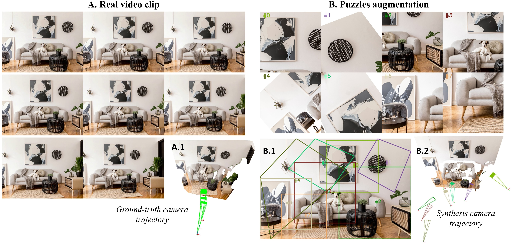

<div align="center">

# Puzzles: Unbounded Video-Depth Augmentation for Scalable End-to-End 3D Reconstruction

<a href="https://jiahao-ma.github.io/puzzles/"></a>
<a href='https://jiahao-ma.github.io/puzzles/'></a>


</div>



**Puzzles** is a novel data‐augmentation framework that synthesizes diverse, view‐consistent video–depth sequences from single images or video clips to train feedforward 3D reconstruction networks at scale.  Existing video-based 3D reconstruction datasets often contain redundant frames due to fixed camera trajectories after recording (A.1). *Puzzles* increases view diversity by generating novel viewpoints from single image or video clips (B.1) and simulates realistic camera trajectories  (B.2) to support 3D reconstruction training.

***Check our [website](https://jiahao-ma.github.io/puzzles/) for videos and reconstruction results!***

## TODO List
- [x] Release Image-to-Clips tutorial and demo.
- [ ] Release Clips-to-Clips tutorial and demo.
- [x] Release evaluation and training code.

## Installation Guide
Follow these steps to set up the **Puzzles** codebase on your system.


### 1. Clone this repository
```bash
git clone https://github.com/Jiahao-Ma/puzzles-code.git
cd puzzles-code
```

### 2.  Create conda environment

```bash
conda create -n puzzles python=3.9 cmake=3.14.0
conda install pytorch==2.3.0 torchvision==0.18.0 torchaudio==2.3.0 pytorch-cuda=11.8 -c pytorch -c nvidia  # use the correct version of cuda for your system

pip install -r requirements.txt
```

### 3. Install Open3D (necessary)

- **With GUI support:**
    ```bash
    pip install -U -f https://www.open3d.org/docs/latest/getting_started.html open3d
    ```
- **Headless version (no display server):**

    Follow the [Open3D headless rendering guide](https://www.open3d.org/html/tutorial/visualization/headless_rendering.html).

### 4. Build CUDA kernels for RoPE
```bash
cd croco/models/curope/
python setup.py build_ext --inplace
cd ../../../
```


### 5. Download the DUSt3R checkpoint
```bash
# Create a directory for checkpoints and download the model
mkdir checkpoints
cd checkpoints
wget https://download.europe.naverlabs.com/ComputerVision/DUSt3R/DUSt3R_ViTLarge_BaseDecoder_512_dpt.pth
```

## Quick Start
The **Quick Start** section helps you get up and running with Image-to-Clips in just a few commands:

### 1. Interactive tutorial
Launches a [Jupyter notebook](https://github.com/Jiahao-Ma/puzzles-code/blob/main/Image2Clips.ipynb) that walks you through the core concepts of **Image-to-Clips** and live examples of turning a single frame into a mini video sequence.

#### 2. Command-line usage  
Demonstrates two minimal examples:
- **Without Puzzles augmentation**: sample ordered overlapping patches to form a video clip.  
- **With Puzzles augmentation**: additionally applies augmentation to a subset of those patches, diversing novel viewpoints.

```bash
# Without Puzzles augmentation
python Image2Clips.py --input examples/I2C/alien.jpg --output examples/I2C --threshold 0.01 \
                          --NPuzzles 8 --min_box_size_scale 0.4 --max_box_size_scale 0.8 \
                          --min_overlap 0.1 --max_overlap 0.3 

# With Puzzles augmentation
python Image2Clips.py --input examples/I2C/lamp.jpg --output examples/I2C --threshold 0.01 \
                          --NPuzzles 6 --min_box_size_scale 0.2 --max_box_size_scale 0.5 \
                          --min_overlap 0.1 --max_overlap 0.3 --Augment \
                          --rotate_ratio 0.2 --rotate_min_coverage 0.2 --rotate_max_coverage 0.8 \
                          --max_rotation_angle 60.0 --front_back_ratio_thresh 0.6                          

```
#### Parameters:
- `--input`: Path to the input image.
- `--output`: Path to save the output video clips.
- `--threshold`: Threshold for depth map, remove the discontinuous edge of depth map.
- `--NPuzzles`: Number of puzzles to generate.
- `--min_box_size_scale` and `--max_box_size_scale`: Scale range for the size of the puzzle patches.
- `--min_overlap` and `--max_overlap`: Overlap range between puzzle patches.
- `--Augment`: Enable Puzzles augmentation.
- `--rotate_ratio`: Ratio of puzzles to rotate.
- `--rotate_min_coverage` and `--rotate_max_coverage`: Coverage range for rotated puzzles.
- `--max_rotation_angle`: Maximum rotation angle for puzzles.
- `--front_back_ratio_thresh`: Threshold for front-back ratio to filter out puzzles. (Corresponds to the Section 3.1 `Front-surface coverage test` in the paper)
#### What to expect:
- The first command (`--NPuzzles 8`) produces 8 contiguous video clips.

- The second command (with `--Augment` and rotation flags) intersperses dynamic, rotated views for improved viewpoint diversity.

- Try the examples in the `examples/I2C` directory to see how different parameters affect the output. Please refer to the [scripts.md](/docs/scripts.md) for more examples.

## Training and Evaluation

### Datasets
We use Habitat, ScanNet, ArkitScenes, and BlendedMVS to train model. Please refer to [data_preprocess.md](/docs/data_preprocess.md) for details on dataset preparation.

Below are the commands to train **Spann3R** on the unified dataset of BlendMVS, Habitat, ScanNet, and ArkitScene, both **with** and **without** Puzzles augmentation. Adjust `--nproc_per_node`, `--nnodes`, and rendezvous settings (`--rdzv_*`) to match your cluster.

### Training
Below are the commands to train **Spann3R** on the unified dataset of BlendMVS, Habitat, ScanNet, and ArkitScene, both **with** and **without** Puzzles augmentation. Adjust `--nproc_per_node`, `--nnodes`, and rendezvous settings (`--rdzv_*`) to match your cluster.

#### 1. Train **with** Puzzles augmentation
This run enables Puzzles transforms in the training datasets to simulate novel viewpoints and increase diversity.
```bash
srun torchrun \
    --nproc_per_node=4 \
    --nnodes=1 \
    --rdzv_backend=c10d \
    --rdzv_endpoint=$MASTER_ADDR:$MASTER_PORT \
    --rdzv_id=spann3r_bs_256_run \
    --max_restarts=0 \
    train.py \
    --model "Spann3R(dus3r_name='./checkpoints/DUSt3R_ViTLarge_BaseDecoder_512_dpt.pth', use_feat=False, mem_pos_enc=False)" \
    --batch_size 16 \
    --num_workers 8 \
    --num_workers_test 8 \
    --train_dataset "10000 @ BlendMVS(split='train', ROOT='./data/blendedmvs/', resolution=224, \
                        puzzle_augment={'overlap_depth_threshold': None,\
                                     'puzzle_min_overlap': 0.7,\
                                     'puzzle_max_overlap': 0.95,\
                                     'transform3d':True,\
                                     'transform2d':False,\
                                     'min_random_augment_ratio': 0.4,\
                                     'max_random_augment_ratio': 0.7,\
                                     }) \
                    + 10000 @ habitat(split='train', ROOT='./data/habitat/', resolution=224, \
                        puzzle_augment={'overlap_depth_threshold': 0.3, \
                                         'puzzle_min_overlap': 0.7, \
                                         'puzzle_max_overlap': 0.9, \
                                         'transform3d':True, \
                                         'transform2d':False, \
                                         'min_random_augment_ratio': 0.4, \
                                         'max_random_augment_ratio': 0.7, \
                                         }) \
                    + 10000 @ Scannet(split='train', ROOT='./data/scannet/', resolution=224, max_thresh = 100, \
                        puzzle_augment={'overlap_depth_threshold': 0.3, \
                                            'puzzle_min_overlap': 0.7, \
                                            'puzzle_max_overlap': 0.9, \
                                            'transform3d':True, \
                                            'transform2d':False, \
                                            'min_random_augment_ratio': 0.4, \
                                            'max_random_augment_ratio': 0.7, \
                                            }) \
                    + 10000 @ ArkitScene(split='train', ROOT='./data/arkitscenes/', resolution=224, max_thresh = 100, \
                        puzzle_augment={'overlap_depth_threshold': 0.3, \
                                            'puzzle_min_overlap': 0.7, \
                                            'puzzle_max_overlap': 0.9, \
                                            'transform3d':True, \
                                            'transform2d':False, \
                                            'min_random_augment_ratio': 0.4, \
                                            'max_random_augment_ratio': 0.7, \
                                            })"
    --test_dataset "Scannet(split='val', ROOT='./data/scannet/', resolution=224, num_seq=1, kf_every=10, seed=777, full_video=True, puzzle_augment=None)"
    --output_dir './output/blendmvs_habitat_scannet_arkit_with_puzzles' \
```
#### 2. Train **without** Puzzles augmentation
This run disables all Puzzles transforms, using the same datasets and hyperparameters for a direct baseline comparison.

```bash
srun torchrun \
    --nproc_per_node=4 \
    --nnodes=1 \
    --rdzv_backend=c10d \
    --rdzv_endpoint=$MASTER_ADDR:$MASTER_PORT \
    --rdzv_id=spann3r_bs_256_run \
    --max_restarts=0 \
    train.py \
    --model "Spann3R(dus3r_name='./checkpoints/DUSt3R_ViTLarge_BaseDecoder_512_dpt.pth', use_feat=False, mem_pos_enc=False)" \
    --batch_size 16 \
    --num_workers 8 \
    --num_workers_test 8 \
    --train_dataset "10000 @ BlendMVS(split='train', ROOT='./data/blendedmvs/', resolution=224, \
                        puzzle_augment=None) \
                    + 10000 @ habitat(split='train', ROOT='./data/habitat/', resolution=224, \
                        puzzle_augment=None) \
                    + 10000 @ Scannet(split='train', ROOT='./data/scannet/', resolution=224, max_thresh = 100, \
                        puzzle_augment=None) \
                    + 10000 @ ArkitScene(split='train', ROOT='./data/arkitscenes/', resolution=224, max_thresh = 100, \
                        puzzle_augment=None)"
    --test_dataset "Scannet(split='val', ROOT='./data/scannet/', resolution=224, num_seq=1, kf_every=10, seed=777, full_video=True, puzzle_augment=None)"
    --output_dir './output/blendmvs_habitat_scannet_arkit_without_puzzles' 
```
#### Notes:
- The only difference between the two runs is the presence or absence of the `puzzle_augment` settings in each dataset.
- Customize `--output_dir` to organize your results.

### Evaluation
Please use the following command to evaluate our model:
```bash
python eval.py --exp_path ./output/blendmvs_habitat_scannet_arkit_with_puzzles --exp_name ckpt --conf_thresh 0.0 \
               --ckpt checkpoint-last.pth # or checkpoint-best.pth
```
By running the training and evaluation commands above, you’ll reproduce the similar values and relative improvements reported in the paper. We found that Spann3R with Puzzles hadn’t fully converged after 120 epochs; however, to ensure a fair comparison, we used the same number of training epochs for experiments. If you increase the epoch count, you may achieve even better performance.

## Acknowledgement
Our code, data preprocessing pipeline, and evaluation scripts are based on several awesome repositories:

- [DUSt3R](https://github.com/naver/dust3r)
- [Spann3R](https://hengyiwang.github.io/projects/spanner)
- [MoGe](https://github.com/microsoft/MoGe)
- [SLAM3R](https://github.com/PKU-VCL-3DV/SLAM3R)
- [Fast3R](https://github.com/facebookresearch/fast3r)

We thank the authors for releasing their code!

## Citation
If you find our code or paper useful for your research, please consider citing:
```bibtex
    Cooming soon...
```
